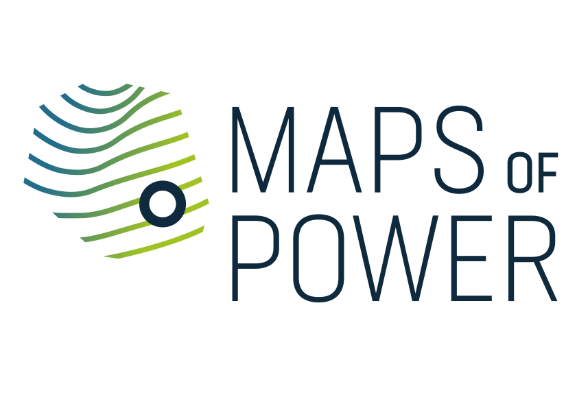

# 🗺️ Maps of Power

<p align="center">
  
</p>

<p align="center">
  <a href="https://github.com/BernhardKoschicek/maps-of-power/actions/workflows/ci-security.yml">
    
  </a>
  <a href=".github/badges/coverage.svg">
    
  </a>
  <a href="LICENSE">
    
  </a>
  
  <a href="https://github.com/google-deepmind">
    
  </a>
</p>

---

The research initiative **Maps of Power** serves the methodological and interdisciplinary networking of scholars in the field of *Historical Geography*. 

Founded in 2019 under the title **"Maps of Power: Historical Atlas of Places, Borderzones and Migration Dynamics in Byzantium (TIB Balkans)"**, it emerged from the idea of deepening historical-geographical research methodologically and broadening it thematically.

Building on the long-running project **[Tabula Imperii Byzantini (TIB)](https://tib.oeaw.ac.at/)** — conducted at the *Austrian Academy of Sciences (Vienna)* since 1966 — the initiative aims to expand the spatial focus of the TIB beyond the Byzantine world to include other European regions of the Middle Ages.

The successfully completed cluster project **["Digitising Patterns of Power (DPP): Peripherical Mountains in the Medieval World"](https://dpp.oeaw.ac.at/)** can be seen as a methodological and conceptual precursor to this work.

---

## 🚀 Key Features

*   **Interactive Maps**: High-fidelity mapping of historical regions, borderzones, and migration dynamics.
*   **Historical Geography Analytics**: Visualizing networks and spatial developments across periods.
*   **State-of-the-Art CI/CD & Security**: Automated security audits (Bandit), dependency vulnerability checks (pip-audit), and automated test suites with high-coverage reporting.
*   **Modern Python Tooling**: Fully integrated with [uv](https://docs.astral.sh/uv/) for lightning-fast package management and deterministic environments.

---

## 🛠️ Installation & Setup

### 📋 Prerequisites

Ensure you have the following installed:
*   [Python 3.10+](https://www.python.org/downloads/)
*   [Node.js 18+ and npm](https://nodejs.org/)
*   ImageMagick (for `libmagickwand-dev`)

On Debian/Ubuntu systems, install system-level requirements:
```bash
sudo apt install libmagickwand-dev python3 python3-venv nodejs npm
```

### 📦 Setup & Dependency Management

1.  **Clone the Repository**
    ```bash
    git clone https://github.com/BernhardKoschicek/maps-of-power.git
    cd maps-of-power
    ```

2.  **Deterministic Python Setup (using `uv`)**
    This project uses `uv` for modern, deterministic dependency management:
    ```bash
    # Pin Python version and sync all virtualenv dependencies
    uv python pin 3.10
    uv sync
    ```

3.  **Frontend Setup**
    ```bash
    cd mop/static
    npm install
    cd ../..
    ```

---

## 🏃 Running the Application

Start the Flask backend and the development assets concurrently:

```bash
# Start Flask Backend (in the root directory)
uv run python runserver.py

# Run Frontend Assets (in mop/static directory)
cd mop/static
npm run dev
```

---

## 🧪 Tests & Security

###  pytest & Code Coverage
We maintain an extremely high testing standard (**96.4%+** code coverage). Run the test suite and output a detailed coverage report locally:
```bash
uv run pytest --cov=. --cov-report=term-missing
```

### 🔒 Security Audits
We run automated SAST scans on every single push. Run code vulnerability checks locally:
```bash
uvx bandit -r . -ll -x .venv,tests
```

---

## 📁 Project Structure

```
maps-of-power/
├── .github/
│   ├── badges/         # Dynamic coverage SVGs
│   └── workflows/      # ci-security.yml workflow definitions
├── mop/                # Core application directory
│   ├── static/         # Frontend static assets (JS/CSS)
│   ├── templates/      # Jinja2 Flask templates
│   └── ...
├── api/                # RESTful API endpoints
├── tests/              # Pytest integration & unit test suites
├── pyproject.toml      # Dependency & project configurations
├── uv.lock             # Deterministic dependency lockfile
└── README.md           # This document
```

---

## 🤖 Agentic Engineering

> 🧠 **AI-Engineered Repository**
> This repository is developed, secured, and maintained using **Agentic AI Engineering**. All automated CI/CD security checks, code vulnerability resolutions (e.g. XSS mitigation in `image_gallery`), testing integrations, and coverage report workflows have been designed and implemented autonomously by agentic coding assistants.

---

## 📄 License

This project is open-source and licensed under the **[MIT License](LICENSE)**.

---

## 🧑‍💻 Authors & Credits

*   Developed and maintained by the **Maps of Power** research group.
*   Hosted and supported by the **Austrian Academy of Sciences (ÖAW)**.
*   Precursor methodologies courtesy of **Digitising Patterns of Power (DPP)**.
